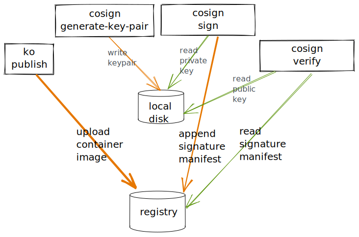
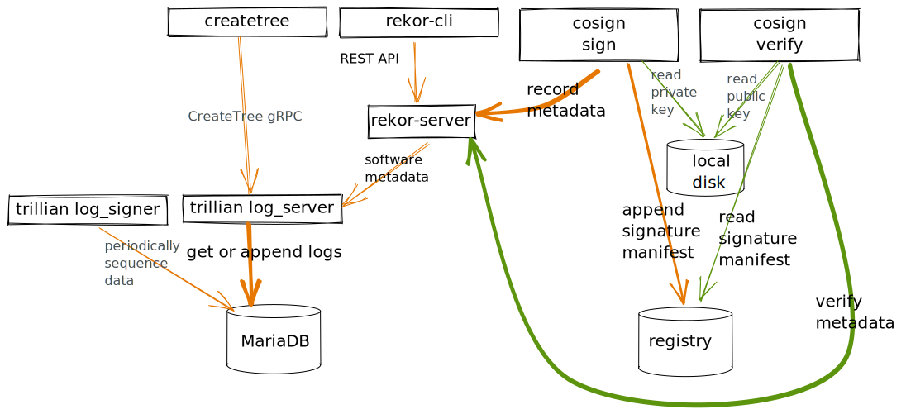
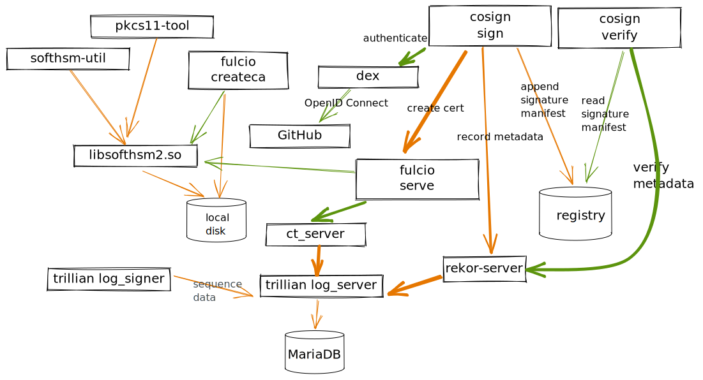

# sigstore-the-local-way

The sigstore-the-local-way tutorial will teach you how to build and configure a local [sigstore](https://www.sigstore.dev/) stack (cosign, rekor, fulcio) and use it to sign and verify container signatures. It can be completed in about 15 minutes.

This tutorial is heavily based on [Sigstore the Hard Way](https://github.com/lukehinds/sigstore-the-hard-way), though simplified for local use without skipping any of the sigstore-specific steps. For example, this tutorial omits actions relating to provisioning services via the Google Cloud Platform, DNS updates, HAProxy, or Certbot. This new tutorial has also been modified for cross-platform use and was developed using [OpenBSD](https://www.openbsd.org/) and [fish](https://fishshell.com/).

This tutorial explores three levels of signing & verification that sigstore makes available, adding new dependencies each time:

1. Signing a container against a local OCI registry
2. Signing a container against a local OCI registry and the Rekor transparency log
2. Keyless signing a container against a local OCI registry and the Rekor transparency log

## Environment

This tutorial involves launching several foreground services, so using a terminal multiplexer such as [tmux](https://github.com/tmux/tmux/wiki) or [screen](https://www.gnu.org/software/screen/) is highly recommended.

As a bonus, this repository includes a [launch script](launch-sigstore.sh) to relaunch the sigstore stack using tmux any time after the completion of the tutorial.

If you run into an error, be sure to check the Appendix for a list of errors you might bump into. 

## Installation of non-sigstore prerequisites

Installing the full-stack requires the Go programming language, a SQL database, and a handful of security tools:

* Arch Linux: `sudo pacman -S mariadb git softhsm opensc go`
* Debian|Ubuntu: `sudo apt-get install -y mariadb-server git softhsm2 opensc`
* Fedora: `sudo dnf install mariadb-server git go softhsm opensc`
* FreeBSD: `doas pkg install mariadb105-server git softhsm2 opensc`
* Gentoo: `sudo emerge mariadb git go softhsm opensc`
* macOS: `brew install mariadb go softhsm opensc`
* OpenBSD: `doas pkg_add mariadb-server git go softhsm2 opensc`
* NetBSD: `doas pkgin install mariadb-server git go softhsm2 opensc`

Verify that the Go version in your path is v1.16 or higher:

```shell
go version
```

If your Go version is too old, uninstall it and install the latest from https://go.dev/dl/

## Level 1: Basic signing against a local registry



We'll run through the steps in the above rectangles, starting from left (ko) to right (cosign verify).

### 1.1: Starting a local registry

sigstore can sign against any container registry. In the interest of keeping things local, we'll run a local registry. You may want to run this in tmux or screen as it is one of the many foreground services you will start:

```shell
go install github.com/google/go-containerregistry/cmd/registry@latest
$HOME/go/bin/registry
```

If it's successful, the registry command will quietly hang until an incoming request arrives. Start a new terminal window or tab and let's move on!

### 1.2: Pushing an unsigned image to the local registry

For this demo, we will build the rekor-cli tool into an unsigned image and push it locally.

Check out the rekor codebase, and use `ko` to build and push an unsigned image to our local registry:

```shell
mkdir -p $HOME/sigstore-local/src
cd $HOME/sigstore-local/src
git clone https://github.com/sigstore/rekor.git

go install github.com/google/ko@latest
cd $HOME/sigstore-local/src/rekor/cmd
KO_DOCKER_REPO=localhost:1338/demo $HOME/go/bin/ko publish ./rekor-cli
```

Here is what successful output looks like:

```
2022/02/03 15:38:35 Published localhost:1338/demo/rekor-cli-e3df3bc7cfcbe584a2639931193267e9@sha256:184a7313e59492c366e505acdb91eeeca0abdbc40281c0dd4933aab161179760
localhost:1338/demo/rekor-cli-e3df3bc7cfcbe584a2639931193267e9@sha256:184a7313e59492c366e505acdb91eeeca0abdbc40281c0dd4933aab161179760
```

### 1.3: Keyed-signing with cosign

Install the latest release:

```shell
go install github.com/sigstore/cosign/cmd/cosign@latest
```

The most basic usage of cosign uses a local key pair. You can use any password you like, even an empty one:

```shell
cd $HOME/sigstore-local
$HOME/go/bin/cosign generate-key-pair
```

Sign the container we just published:

```shell
$HOME/go/bin/cosign sign --key cosign.key localhost:1338/demo/rekor-cli-e3df3bc7cfcbe584a2639931193267e9:latest
```

And validate the signature:

```shell
$HOME/go/bin/cosign verify --key cosign.pub localhost:1338/demo/rekor-cli-e3df3bc7cfcbe584a2639931193267e9 || echo OHNO
```

The successful verification output looks verbose and scary, but everything checks out:

```
Verification for localhost:1338/demo/rekor-cli-e3df3bc7cfcbe584a2639931193267e9:latest --
The following checks were performed on each of these signatures:
  - The cosign claims were validated
  - The signatures were verified against the specified public key
  - Any certificates were verified against the Fulcio roots.

[{"critical":{"identity":{"docker-reference":"localhost:1338/demo/rekor-cli-e3df3bc7cfcbe584a2639931193267e9"},"image":{"docker-manifest-digest":"sha256:3a46c2e44bfe8ea0231af6ab2f7adebd0bab4a892929b307c0b48d6958863a4d"},"type":"cosign container image signature"},"optional":null}]
```

Congratulations! You have signed your first container using sigstore. It is also possible to sign binaries or other blobs of text using `cosign`, see [Working with other artifacts](https://github.com/sigstore/cosign/#working-with-other-artifacts).

## Act II: Certificate Transparency with Rekor

The way we've signed a container so far only relies on a single mutable source of truth: the container registry. With Rekor, we will introduce a second immutable source of truth to the system.



### 2.1: Creating a database backend with MariaDB

While Sigstore can use multiple database backends, this tutorial uses MariaDB. Once you've installed the prerequisites, run the following to start the database up locally in a locked-down fashion:

* Arch: `sudo mariadb-install-db --user=mysql --basedir=/usr --datadir=/var/lib/mysql; sudo systemctl start mariadb && sudo mysql_secure_installation`
* Debian|Ubuntu: `sudo mysql_secure_installation`
* Fedora: `sudo systemctl start mariadb && sudo mysql_secure_installation`
* FreeBSD: `sudo sudo service mysql-server start && sudo mysql_secure_installation`
* macOS: `brew services start mariadb && sudo mysql_secure_installation`
* OpenBSD: `doas mysql_install_db && doas rcctl start mysqld && doas mysql_secure_installation`

During the secure script, I recommend skipping the password change, but answering "YES" to everything else. Once complete, create the database tables which Trillian will need:

```shell
cd $HOME/sigstore-local/src/rekor/scripts
sudo sh -x createdb.sh
```

### 2.2: Installing Trillian

Install Trillian, which provides a tamper-proof append-only log based on [Merkle Trees](https://en.wikipedia.org/wiki/Merkle_tree) via a [gRPC](https://grpc.io/) API. The data will be stored in the MariaDB database we created.

```
go install github.com/google/trillian/cmd/trillian_log_server@latest
go install github.com/google/trillian/cmd/trillian_log_signer@latest
go install github.com/google/trillian/cmd/createtree@latest
```

Start the [log_server](https://rgdd.medium.com/observations-from-a-trillian-play-date-451bccc0aac6), which will provide a Trillian API to both Rekor and the Certificate Transparency frontends (also referred to as personalities):

```shell
$HOME/go/bin/trillian_log_server -http_endpoint=localhost:8090 -rpc_endpoint=localhost:8091 --logtostderr
```

Start the log signer, which periodically checks the database and [sequences the data into a merkle tree](https://rgdd.medium.com/trillian-log-sequencing-demystified-a3b5097b6547):


```shell
$HOME/go/bin/trillian_log_signer --logtostderr --force_master --http_endpoint=localhost:8190 -rpc_endpoint=localhost:8191
```

The Trillian system is multi-tenant and can support multiple independent Merkle trees. Run this command to send a gRPC request to create a tree and save the log_id for future use:

```shell
$HOME/go/bin/createtree --admin_server localhost:8091 | tee $HOME/sigstore-local/trillian.log_id
```

### 2.3: Installing Rekor

The Rekor project provides a restful API based server for validation and a transparency log for storage. Install it from source:

```shell
cd $HOME/sigstore-local/src/rekor
go install ./cmd/rekor-cli ./cmd/rekor-server
```

Start rekor:

```shell
$HOME/go/bin/rekor-server serve --trillian_log_server.port=8091 --enable_retrieve_api=false
```

Upload a test artifact to rekor:

```shell
cd $HOME/sigstore-local/src/rekor
$HOME/go/bin/rekor-cli upload --artifact tests/test_file.txt --public-key tests/test_public_key.key --signature tests/test_file.sig \
  --rekor_server http://localhost:3000
```

If it works, the following will be output:

`Created entry at index 0, available at: http://127.0.0.1:3000/api/v1/log/entries/d2f305428d7c222d7b77f56453dd4b6e6851752ecacc78e5992779c8f9b61dd9`

You can inspect the resulting record with:

```shell
curl -s http://127.0.0.1:3000/api/v1/log/entries/d2f305428d7c222d7b77f56453dd4b6e6851752ecacc78e5992779c8f9b61dd9
```

### 2.4: Keyed verifiable signing with Cosign & Rekor

With Rekor setup, we can now sign and upload the signature for our image:

```shell
COSIGN_EXPERIMENTAL=1 $HOME/go/bin/cosign sign --key $HOME/sigstore-local/cosign.key \
  --rekor-url=http://localhost:3000 \
  localhost:1338/demo/rekor-cli-e3df3bc7cfcbe584a2639931193267e9
```

Verify the container against the OCI attestation and the Rekor record:

```shell
COSIGN_EXPERIMENTAL=1 $HOME/go/bin/cosign verify --key $HOME/sigstore-local/cosign.pub \
  --rekor-url=http://localhost:3000 \
  localhost:1338/demo/rekor-cli-e3df3bc7cfcbe584a2639931193267e9

```

With this invocation, cosign will check the OCI metadata and rekor. Rekor in-turn, will use Trillian and the MariaDB database we setup earlier to verify the certificate. Success looks like this:

```
Verification for localhost:1338/demo/rekor-cli-e3df3bc7cfcbe584a2639931193267e9:latest --
The following checks were performed on each of these signatures:
  - The cosign claims were validated
  - The claims were present in the transparency log
  - The signatures were integrated into the transparency log when the certificate was valid
  - The signatures were verified against the specified public key
  - Any certificates were verified against the Fulcio roots.

[{"critical":{"identity":{"docker-reference":"localhost:1338/demo/rekor-cli-e3df3bc7cfcbe584a2639931193267e9"},"image":{"docker-manifest-digest":"sha256:35b25714b56211d548b97a858a1485b254228fe9889607246e96ed03ed77017d"},"type":"cosign container image signature"},"optional":{"Bundle":{"SignedEntryTimestamp":"MEUCIGhbOHcduQOWrsL8CaAHeSB1pQXintGyo2OlEs7yflWcAiEA2Wk/WeT5GOpYkpV2bZzaZBEt925W00VOAE/aHi7yoIY=","Payload":{"body":"eyJhcGlWZXJzaW9uIjoiMC4wLjEiLCJraW5kIjoiaGFzaGVkcmVrb3JkIiwic3BlYyI6eyJkYXRhIjp7Imhhc2giOnsiYWxnb3JpdGhtIjoic2hhMjU2IiwidmFsdWUiOiI4Yzg1YjNhMjQ5Y2I1MjNlYTNiYjRiM2RiN2RmMTc0Zjc0ZjI0NGJiNmJmN2QyNjI3ZjJjNTZlNmYzZjliZmQzIn19LCJzaWduYXR1cmUiOnsiY29udGVudCI6Ik1FWUNJUUM4NXZrMEoxQ0dCdFVGMEtBVXpCOHRCWG10TzkreFNQS2NldG4wYm52eGVnSWhBT0lnWG9Xa3FoR2FiWm8xRFFUem5GaTFKRU5vL0VvSDg5bGh0OWthZWNpOCIsInB1YmxpY0tleSI6eyJjb250ZW50IjoiTFMwdExTMUNSVWRKVGlCUVZVSk1TVU1nUzBWWkxTMHRMUzBLVFVacmQwVjNXVWhMYjFwSmVtb3dRMEZSV1VsTGIxcEplbW93UkVGUlkwUlJaMEZGY0d0WWFITTNSWGxoY1V0V1VsbFdMMkZ3Y0RsVE4ybGtNRTFxZVFwaU5sTXZiMnhIWkhoeWJuSnVaakZ3VlU5eFVFbFRVVzlWYVZseE1WTjRURUpvVEVWaFp6aHJTSFV2WTA1dlpUQllXR2g0VURGdGRHcDNQVDBLTFMwdExTMUZUa1FnVUZWQ1RFbERJRXRGV1MwdExTMHRDZz09In19fX0=","integratedTime":1643917737,"logIndex":1,"logID":"4d2e4729bc008d76b4962364d19fe3f7a7b7bd58627bbafa0c19d9eac9797291"}}}}]
```

Go take an ice cream break if you got this far. You earned it!

## 3.0: Keyless signing with Fulcio (EXPERIMENTAL)



### 3.1: Install Fulcio

Fulcio is a service for dynamically generating code-signing certificates based on authenticated [OpenID Connect](https://openid.net/connect/) identities. This allows for key-less signing from authenticated service accounts or humans.

For this demo, we will use Fulcio to dynamically create code signing certificates based on GitHub identities.

```shell
cd $HOME/sigstore-local/src
git clone https://github.com/sigstore/fulcio.git
cd fulcio
go install .
```

### 3.2: Configure SoftHSM

SoftHSM implements a cryptographic store accessible through a PKCS #11 interface. You can use it to explore PKCS #11 without having a Hardware Security Module. For this demo, we will configure sigstore to reference tokens in $HOME/sigstore-local/tokens:

```shell
mkdir -p $HOME/sigstore-local/tokens

printf "\
directories.tokendir = $HOME/sigstore-local/tokens
log.level = DEBUG
" > $HOME/sigstore-local/softhsm2.conf

export SOFTHSM2_CONF=$HOME/sigstore-local/softhsm2.conf
```

Create your first HSM token:

```shell
softhsm2-util --init-token --slot 0 --label fulcio
```

For this tutorial, set both the SO (Security Officer) and User PIN to `2324`.

### 3.3: Create a CA certificate with OpenSC

Configure OpenSC:

* (FreeBSD|OpenBSD|NetBSD): `export PKCS11_MOD=/usr/local/lib/softhsm/libsofthsm2.so`
* (Arch|Debian|Ubuntu): `export PKCS11_MOD=/usr/lib/softhsm/libsofthsm2.so`
* Fedora: `export PKCS11_MOD=/usr/lib64/libsofthsm2.so`
* macOS: `export PKCS11_MOD=$(brew --prefix softhsm)/lib/softhsm/libsofthsm2.so`

Create a configuration file for the pkcs11 crypto library using the user PIN code you specified in the previous step:

```shell
mkdir -p $HOME/sigstore-local/config
echo "{ \"Path\": \"$PKCS11_MOD\", \"TokenLabel\": \"fulcio\", \"Pin\": \"2324\" }" > $HOME/sigstore-local/config/crypto11.conf
```

Save your key into the HSM:

```shell
SOFTHSM2_CONF=$HOME/sigstore-local/softhsm2.conf pkcs11-tool \
  --module=$PKCS11_MOD \
  --login \
  --login-type user \
  --keypairgen \
  --id 1 \
  --label PKCS11CA \
  --key-type EC:secp384r1
```

Create a CA root certificate:

```shell
cd $HOME/sigstore-local
SOFTHSM2_CONF=$HOME/sigstore-local/softhsm2.conf $HOME/go/bin/fulcio createca \
  --org=acme \
  --country=USA \
  --locality=Anytown \
  --province=AnyPlace \
  --postal-code=ABCDEF \
  --street-address="123 Main St" \
  --hsm-caroot-id 1 \
  --out ca-root.pem
```

## 3.4: Install the Certificate Transparency Frontend

The `ct_server` is an [RFC6962-compliant](https://datatracker.ietf.org/doc/html/rfc6962) certificate transparency log that stores only the code-signing certificates issued by Fulcio.

```shell
go install github.com/google/certificate-transparency-go/trillian/ctfe/ct_server@latest
```

Next we need to setup a private key. I'll use 2324 again, but you can use anything 4-characters or longer:


```shell
export PASS=<password entered>
cd $HOME/sigstore-local
openssl ecparam -genkey -name prime256v1 -noout -out ct_unenc.key
openssl ec -aes256 -in ct_unenc.key -out ct_private.pem -passout pass:$PASS
openssl ec -aes256 -in ct_unenc.key -out ct_public.pem -pubout -passout pass:$PASS
rm ct_unenc.key
```

Look up the Trillian log ID we previously created, and set the LOG_ID variable to the resulting value:

```shell
cat $HOME/sigstore-local/trillian.log_id
export LOG_ID=<value of trillian.log_id>
```

Then populate the Certificate Transparency configuration file. It will fill in the password and log id:

```shell
printf "\
config {
  log_id: $LOG_ID
  prefix: \"sigstore\"
  roots_pem_file: \"$HOME/sigstore-local/ca-root.pem\"
  private_key: {
    [type.googleapis.com/keyspb.PEMKeyFile] {
       path: \"$HOME/sigstore-local/ct_private.pem\"
       password: \"$PASS\"
    }
  }
}
" | tee $HOME/sigstore-local/ct.cfg
```

Start the certificate transparency server:

```shell
$HOME/go/bin/ct_server -logtostderr -log_config $HOME/sigstore-local/ct.cfg -log_rpc_server localhost:8091 -http_endpoint 0.0.0.0:6105
```

If successful, the output will look like this:

```
I0128 11:42:16.401794   65425 main.go:121] **** CT HTTP Server Starting ****
...
I0128 11:42:16.511090   65425 instance.go:85] Start internal get-sth operations on sigstore (8494167753837750461)
```

### 3.5: Installing Dex for OpenID authentication

Dex is a federated OpenID Connect Provider, which connects OpenID identities from multiple providers to drive authentication for other apps. Dex will serve as your OIDC issuer. Unfortunately, Dex doesn't support `go install`, so you need to build it manually:

```shell
cd $HOME/sigstore-local/src
git clone https://github.com/dexidp/dex.git
cd dex
gmake build || make build
cp bin/dex $HOME/go/bin
```

For this demonstration, we'll use GitHub to authenticate requests. Visit [GitHub: Register a new OAuth Application](https://github.com/settings/applications/new), and fill in the form accordingly:

* Application Name: `My Local Sigstore Adventure`
* Homepage URL, use `http://localhost/`
* Authorization callback URL: `http://localhost:5556/callback`

When you click **Register Application**, it will output a client ID. Save it to your environment:

```shell
export GITHUB_CLIENT_ID=<your id>
```

Click the `Generate a new client secret` button, and copy the long alphanumeric string it emits into your environment:

```shell
export GITHUB_CLIENT_SECRET=<your client secret>
```

Create a Dex configuration that answers local OAuth requests, delegating the authentication to GitHub:

```shell
printf "\
issuer: http://localhost:5556

storage:
  type: sqlite3
  config:
    file: ./dex.db
web:
  http: 127.0.0.1:5556
frontend:
  issuer: sigstore
  theme: light

logger:
  level: "debug"
  format: "json"

oauth2:
  responseTypes: [ "code" ]
  skipApprovalScreen: false
  alwaysShowLoginScreen: true

staticClients:
  - id: sigstore
    public: true
    name: 'sigstore'

connectors:
- type: github
  id: github-sigstore-test
  name: GitHub
  config:
     clientID: $GITHUB_CLIENT_ID
     clientSecret: $GITHUB_CLIENT_SECRET
     redirectURI: http://localhost:5556/callback
" | tee $HOME/sigstore-local/dex-config.yaml
```

Start dex:

```shell
$HOME/go/bin/dex serve $HOME/sigstore-local/dex-config.yaml
```

### 3.6: Setting up Fulcio for key-less signatures

Populate the Fulcio configuration file:

```shell
printf '
{
  "OIDCIssuers": {
    "http://localhost:5556": {
      "IssuerURL": "http://localhost:5556",
      "ClientID": "sigstore",
      "Type": "email"
    }
  }
}
' > $HOME/sigstore-local/config/fulcio.json
```

Start Fulcio:

```shell
cd $HOME/sigstore-local
SOFTHSM2_CONF=$HOME/sigstore-local/softhsm2.conf $HOME/go/bin/fulcio serve \
  --config-path=config/fulcio.json --ca=pkcs11ca --hsm-caroot-id=1 --ct-log-url=http://localhost:6105/sigstore \
  --host=127.0.0.1 --port=5000
```

If it is working, you will see a message similar to:

`2022-01-27T16:35:11.359-0800	INFO	app/serve.go:173	127.0.0.1:5000`

### 3.7: Local Keyless Signing

Now let's try some experimental cosign features: Integration with the Rekor transparency log and keyless signatures using the Fulcio CA. Fulcio will instead rely on a combination of certificates stored in SoftHSM and the OIDC tokens provided by Dex and Github:

**NOTE: If you are running cosign on a non-local machine, wait 2 minutes for the `Enter verification code` prompt, and then forward the Dex webserver port to your local workstation using `ssh -L 5556:127.0.0.1:5556 <dex server>`. Then visit the URL and enter the resulting verification code into the terminal.**

Sign the container with our local certificate:

```shell
SIGSTORE_CT_LOG_PUBLIC_KEY_FILE=$HOME/sigstore-local/ct_public.pem \
  COSIGN_EXPERIMENTAL=1 $HOME/go/bin/cosign sign \
      --oidc-issuer=http://localhost:5556 \
      --fulcio-url=http://127.0.0.1:5000 \
      --rekor-url=http://localhost:3000 \
      localhost:1338/demo/rekor-cli-e3df3bc7cfcbe584a2639931193267e9
```

Successful output will look like this:

```
**Warning** Using a non-standard public key for verifying SCT: /home/t/sigstore-local/ct_public.pem
Successfully verified SCT...
tlog entry created with index: 17
Pushing signature to: localhost:1338/demo/rekor-cli-e3df3bc7cfcbe584a2639931193267e9
```

NOTE: If you get a `NAME_UNKNOWN: Unknown name` error, re-run the `ko publish` command in step 1.2.

Verify the certificate:

```shell
SIGSTORE_ROOT_FILE=$HOME/sigstore-local/ca-root.pem COSIGN_EXPERIMENTAL=1 \
  $HOME/go/bin/cosign verify --rekor-url=http://localhost:3000 \
  localhost:1338/demo/rekor-cli-e3df3bc7cfcbe584a2639931193267e9
```

Congratulations! You made it!

## 4.0: Appendix

### 4.1: Resuming the tutorial

If you have rebooted and wish to bring the local sigstore stack up again, you can do so if you have checked out this repository and have [tmux](https://github.com/tmux/tmux/wiki) installed:

```shell
sh launch-sigstore.sh
```

### 4.2: Uninstalling the local sigstore installation

After killing any daemons started:

```shell
sudo mysql -u root -e "DROP DATABASE IF EXISTS test;"
rm -Rf $HOME/sigstore-local
```

### 4.3: Errors

cosign:
* `NAME_UNKNOWN: Unknown name`: The package name you are trying to sign does not appear in the registry. Re-run the `ko publish` step and confirm you are signing the correct package name. 

ct_server:
* `Failed to read config: failed to parse LogConfigSet from "/Users/t/sigstore-local/ct.cfg" as text protobuf (proto: (line 3:3): invalid value for int64 type: prefix)`: Confirm that the `log_id` field is set properly in `$HOME/sigstore-local/ct.cfg`. It's probably empty!
* `failed to load private key: pemfile: empty password for file`: Check the password field in `$HOME/sigstore-local/ct.cfg`. It's probably empty!
* `x509: decryption password incorrect`: The password in `$HOME/sigstore-local/ct.cfg` doesn't match what's on disk. Re-run step 3.4.
* `Server exited: listen tcp 0.0.0.0:6105: bind: address already in use`: There is already a ct_server process running. Find it using `lsof -i TCP:6105`, then kill it.
* `Failed to retrieve STH for sigstore (30): rpc error: code = NotFound desc = tree ### not found`: The `log_id` field in `$HOME/sigstore-local/ct.cfg` does not match what is in the MySQL database. Re-run the `createtree` command and place the resulting ID number in `ct.cfg`.

fulcio:
* `could not open config file: config/crypto11.conf`: Check that `$HOME/sigstore-local` is your current working directory. If so, you missed part of 3.3.
* `no key pair was found matching label "PKCS11CA"`: SoftHSM does not know about your CA certificate. Re-run the pkcs11 command in step 3.3.
* `getting signer: getting key from Fulcio: retrieving cert: `: TBD

github:
* `404 Page Not Found`: The GitHub clientID or clientSecret field in `$HOME/sigstore-local/dex-config.yaml` is incorrect. Run through step 3.5 again.

openssl:
* `unable to write private key | CRYPTO_internal:result too small`: You pressed enter at a prompt that requires a password containing at least 4 characters.

pkcs11-tool:
* `No slots.`: You may have forgotten to set a value for $PKCS11_MOD.
*  `Failed to load pkcs11 module`: The path specified in `--module` is incorrect. Check the output of `file $PKCS11_MOD`

rekor-cli:
* `Post "http://localhost:3000/api/v1/log/entries": dial tcp [::1]:3000: connect: connection refused`: Rekor isn't running.
* `createLogEntry default  &{Code:500 Message:Unexpected result from transparency log} `: Check that you only have one `rekor-server` process running. If so, try restarting it.

### 4.4: Where to go from here?

* [Official Sigstore Documentation](https://docs.sigstore.dev/): Everything you ever wanted to know about Sigstore
* [sigstore-scaffolding](https://github.com/vaikas/sigstore-scaffolding): Setup sigstore using Kubernetes
* [Sigstore the Hard Way](https://github.com/lukehinds/sigstore-the-hard-way): Setup sigstore using Google Compute Engine
* [Bring your own TUF](https://blog.sigstore.dev/sigstore-bring-your-own-stuf-with-tuf-40febfd2badd): Setup your own TUF root of trust 
